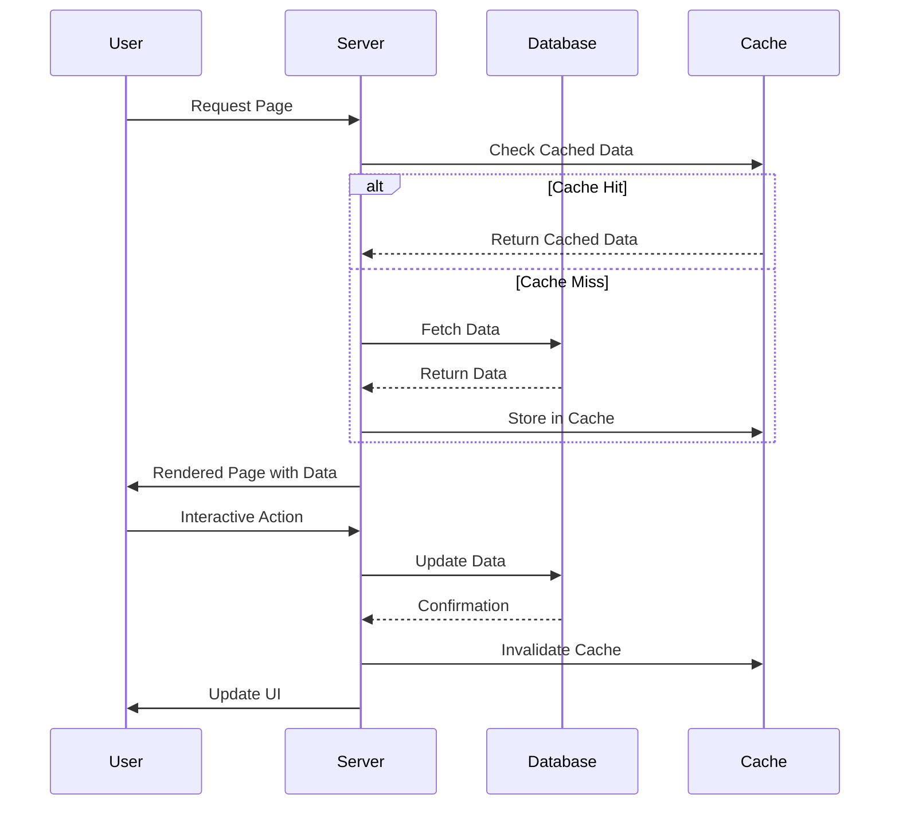

# E-commerce Platform Architecture Diagram

## Current Architecture Issues


## Target Architecture

```mermaid
graph TD
    subgraph "Server Layer"
        A[Server Components] --> B[SSR/SSG]
        B --> C[SEO Optimized]
        B --> D[Fast Initial Load]

        E[API Routes] --> F[Server-side Data Fetching]
        F --> G[Cached Responses]
    end

    subgraph "Client Layer"
        H[Client Components] --> I[Interactive Elements Only]
        I --> J[Optimized Bundle Size]

        K[Error Boundaries] --> L[Graceful Error Handling]
        L --> M[Better UX]
    end

    subgraph "Internationalization"
        N[Locale-based Routing] --> O[/en/ and /ar/ paths]
        O --> P[Proper SEO for each locale]

        Q[RTL/LTR Support] --> R[Direction-aware CSS]
        R --> S[Better Arabic UX]
    end

    subgraph "Performance"
        T[Image Optimization] --> U[Responsive Images]
        U --> V[Faster Load Times]

        W[Code Splitting] --> X[Dynamic Imports]
        X --> Y[Reduced Bundle Size]
    end

    A --> H
    E --> H
    N --> H
    T --> H
```

## Component Architecture Refactoring


## Data Flow Architecture



## Internationalization Architecture


## Performance Optimization Architecture


## SEO Implementation Architecture


## Error Handling Architecture


## Testing Architecture


## Deployment Architecture


## Migration Strategy


